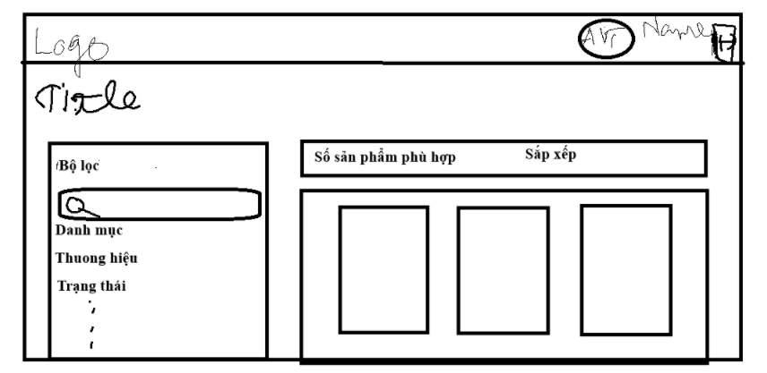
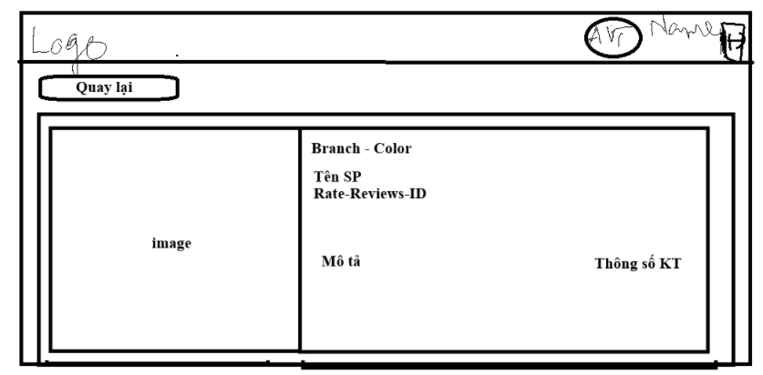

# Decision Log - GEEK UP Product Showcase

Nhật ký quyết định kiến trúc và kỹ thuật của dự án **GEEK UP Product Showcase**. Tài liệu thể hiện quá trình phân tích đề bài, các phương án được cân nhắc, quyết định cuối cùng cùng kết quả thực tế, cũng như các lần sử dụng AI hỗ trợ trong suốt quá trình xây dựng và tự kiểm thử.

## [17:00] - Phân tích đề bài & Xây dựng hướng đi tổng thể

### Tình huống
Nhận đề bài "Product Frontend Technical Assessment" trong khung thời gian 24h. Yêu cầu tổng hợp gồm: 4 màn hình chính (Login, Product List, Product Detail, Logout), tự thiết kế Mock API bằng Mockoon, tối thiểu 100 sản phẩm với Search + Filter đầy đủ trên mọi trường dữ liệu, Responsive chuẩn 1280px, Containerization bằng Docker, và bắt buộc có Decision Log ghi lại tư duy làm bài.

### Các phương án đã cân nhắc
- **Phương án A**: Dùng Create React App + JavaScript thuần + CSS Module. Quen thuộc nhưng CRA đã ngừng bảo trì chính thức, build chậm, không tối ưu cho deadline gấp.
- **Phương án B**: Dùng Vite + React 18 + TypeScript + Tailwind CSS v4. Build/HMR nhanh, type-safe giúp giảm lỗi runtime, phù hợp năng lực bản thân và áp lực thời gian 24h.

### Quyết định
Chọn **Phương án B**. Đồng thời chia công việc thành 4 giai đoạn ưu tiên:
1. Dựng khung dự án + thiết kế Mock API bằng Mockoon.
2. Xây luồng Routing + Auth.
3. Xây Product List/Detail + Filter Engine.
4. Containerization + hoàn thiện tài liệu.

Dành khoảng 2 tiếng cuối làm buffer để tự kiểm thử qua Docker và rà soát lại toàn bộ yêu cầu trước khi nộp.

### Kết quả
Có lộ trình rõ ràng theo mức độ ưu tiên, tránh sa đà vào chi tiết UI sớm khi luồng chức năng chính chưa hoàn chỉnh. Việc dành buffer cuối cùng sau này thực sự cần thiết vì phát hiện thêm một số lỗi phát sinh khi rà soát và test thật qua Docker (xem phần "Rà soát & Khắc phục lỗi" ở cuối tài liệu).

---

## GIAI ĐOẠN 1: Dựng khung dự án & Thiết kế Mock API

## [18:30] - Khởi tạo cấu trúc dự án & Thiết kế Mock API

### Tình huống
Cần một Mock API Server chuẩn mực để phát triển độc lập và phục vụ đánh giá, đúng tinh thần "tự thiết kế Mock API" mà đề bài yêu cầu.

### Các phương án đã cân nhắc
- **Phương án A**: Hardcode mảng dữ liệu trực tiếp ở Frontend hoặc dùng `json-server` đơn giản.
- **Phương án B**: Dùng **Mockoon CLI** để thiết kế RESTful endpoints (`POST /api/login`, `GET /api/product`, `GET /api/product/:id`, `POST /api/logout`), xuất ra `mockoon-data.json`.

### Quyết định
Chọn **Phương án B** để tuân thủ đúng gợi ý của đề bài, hỗ trợ chạy chính thức qua Docker image `mockoon/cli`, và tách biệt hoàn toàn ranh giới Client/Server.

### Kết quả
Tạo được `mockoon-data.json` with 106 sản phẩm đa dạng thuộc tính (category, brand, price, status, rating, color, stock...), kết nối API ổn định, sẵn sàng chạy độc lập trên Docker.

---

## GIAI ĐOẠN 2: Xây luồng Routing & Auth

## [19:15] - Thiết lập Router & Phân tách Route Danh sách và Chi tiết sản phẩm

### Tình huống
Cần định tuyến để người dùng truy cập trang danh sách và chi tiết sản phẩm một cách rõ ràng, dễ mở rộng, làm nền tảng để gắn cơ chế bảo vệ route theo trạng thái đăng nhập ở bước tiếp theo.

### Các phương án đã cân nhắc
- **Phương án A**: Conditional rendering theo state trên cùng 1 URL.
- **Phương án B**: Dùng `react-router-dom`, tách rõ Route danh sách (`/`) và Route chi tiết (`/product/:id`).

### Quyết định
Chọn **Phương án B** để hỗ trợ nút back/forward của trình duyệt và chỉ mount component cần thiết, tối ưu bộ nhớ.

### Kết quả
Thiết lập thành công khung routing cơ bản, sẵn sàng để tích hợp `ProtectedRoute` ở bước xây dựng Auth tiếp theo.

---

## [19:45] - Quản lý Xác thực & Vòng đời Token

### Tình huống
Cần duy trì phiên đăng nhập qua các lần tải lại trang, gắn `ProtectedRoute` bảo vệ các trang yêu cầu đăng nhập, đồng thời đảm bảo token thực sự được gửi kèm mỗi request cần xác thực chứ không chỉ lưu trữ suông.

### Các phương án đã cân nhắc
- **Phương án A**: Chỉ lưu token trong React Context state (mất khi reload trang).
- **Phương án B**: Lưu token trong `localStorage`, tích hợp Axios interceptor tự động gắn header `Authorization: Bearer <token>` cho mọi request và tự động xử lý lỗi `401` bằng cách xóa token + điều hướng về `/login`.

### Quyết định
Chọn **Phương án B**.

### Kết quả
Token được duy trì qua các lần reload, `ProtectedRoute` chặn truy cập khi chưa đăng nhập, mọi request tới `/api/product` và `/api/logout` đều tự động đính kèm `Authorization`.

---

## GIAI ĐOẠN 3: Xây Product List/Detail & Filter Engine

## [20:30] - Thiết kế Client-side Filtering Pipeline

### Tình huống
Đề bài yêu cầu "Filter is required for ALL the product data" trên tập 100+ sản phẩm mà không cần backend riêng xử lý filter.

### Các phương án đã cân nhắc
- **Phương án A**: Viết toàn bộ state lọc/sắp xếp/phân trang trực tiếp trong `ProductListPage.tsx`.
- **Phương án B**: Xây Custom Hook `useProductFilter.ts` xử lý tuần tự: `[Dữ liệu thô] → [Tìm kiếm] → [Lọc đa điều kiện] → [Sắp xếp] → [Phân trang]`.

### Quyết định
Chọn **Phương án B**, bọc các bước tính toán trong `useMemo` để tránh tính lại không cần thiết khi re-render.

### Kết quả
Tách biệt tầng logic và tầng hiển thị, filter hoạt động mượt trên toàn bộ trường dữ liệu (category, brand, color, tags, status, price, stock, rating, năm phát hành...), dễ maintain và test độc lập.

---

## [21:15] - Tự động hóa Bộ lọc Linh hoạt (Dynamic Filter Options)

### Tình huống
Cần hiển thị danh sách brand/category/color/năm lên Sidebar mà không phải sửa code mỗi khi thay đổi tập dữ liệu.

### Các phương án đã cân nhắc
- **Phương án A**: Hardcode mảng hằng số tĩnh ở Frontend.
- **Phương án B**: Trích xuất động các giá trị duy nhất từ dữ liệu API trả về qua helper `getUniqueProductOptions(products)`.

### Quyết định
Chọn **Phương án B** để giao diện filter hoàn toàn hướng dữ liệu.

### Kết quả
Sidebar tự động hiển thị đúng brand/category/color thực tế có trong tập dữ liệu, không cần sửa code khi dữ liệu thay đổi.

---

## [22:00] - Phác thảo bố cục UI/UX Responsive

### Tình huống
Cần bố cục tối ưu cho PC (≥1280px theo đúng yêu cầu đề bài) và Mobile (<1280px) cho màn hình Product List và Product Detail.

### Bản phác họa màn hình Danh sách sản phẩm (Product List Sketch)

### Bản phác họa màn hình Chi tiết sản phẩm (Product Detail Sketch)

### Quyết định bố cục
- **PC (≥1280px)**: Header cố định trên cùng, Filter Sidebar cố định bên trái, Grid sản phẩm chiếm phần còn lại.
- **Mobile (<1280px)**: Ẩn Sidebar, thay bằng nút "Bộ lọc" mở Drawer trượt từ cạnh phải.

### Kết quả
Xác định rõ layout mục tiêu cho cả 2 màn hình. Việc breakpoint 1280px có được map đúng theo yêu cầu đề bài hay không (thay vì mặc định 1024px của Tailwind) được xác nhận lại kỹ hơn ở bước rà soát cuối.

---

## [22:40] - Sử dụng AI: Sinh khung JSX + Tailwind từ bố cục đã phác thảo

### Prompt đã dùng
> "Tôi cần khung JSX + Tailwind CSS v4 cho layout: Trên PC gồm Header top, Sidebar bộ lọc bên trái cố định, bên phải là Product Grid nhiều cột. Trên Mobile, Sidebar chuyển thành Drawer trượt từ cạnh phải, có nút toggle ở Header. Viết cấu trúc component cơ bản, chưa cần style chi tiết."

### Kết quả AI trả về
AI sinh khung JSX với cấu trúc Grid/Sidebar/Drawer cơ bản, phản hồi nhanh nhưng dùng một số class `w-[320px]` cứng cho Drawer mobile và thiếu thuộc tính accessibility.

### Đánh giá của tôi
Phần khung tổng thể dùng được, nhưng phải sửa lại: bỏ width cố định gây tràn màn hình trên thiết bị siêu nhỏ, thay bằng class responsive linh hoạt; bổ sung `aria-label`, `role="dialog"` và tối ưu nút đóng cho Drawer mobile.

---

## GIAI ĐOẠN 4: Containerization & Hoàn thiện tài liệu

## [23:30] - Đóng gói Containerization (Docker & Docker Compose)

### Tình huống
Đề bài yêu cầu triển khai bằng một lệnh duy nhất qua Docker Compose, quản lý đồng thời `frontend` và `mock-api`.

### Quyết định kiến trúc
- Dockerfile multi-stage: giai đoạn 1 build tĩnh bằng Node, giai đoạn 2 phục vụ qua Nginx Alpine.
- `nginx.conf` hỗ trợ SPA fallback (`try_files ... /index.html`) và reverse proxy `/api/` sang service `mock-api`.
- `docker-compose.yml` liên kết 2 service, `mock-api` dùng image chính thức `mockoon/cli`.

### Kết quả
Ứng dụng khởi chạy bằng `docker compose up -d --build`, frontend tại `localhost:8080` giao tiếp với mock API qua Nginx proxy không lỗi CORS. Kết thúc giai đoạn xây dựng chính, chuyển sang buffer time để rà soát và tự kiểm thử toàn diện trước khi nộp bài.

---

## RÀ SOÁT & KHẮC PHỤC LỖI (Buffer time trước khi nộp bài)

Toàn bộ mục dưới đây là các vấn đề phát hiện được trong quá trình tự rà soát lại mã nguồn và kiểm thử thực tế sau khi đã hoàn thành 4 giai đoạn xây dựng chính, không thuộc luồng phát triển ban đầu.

## [00:10] - Rà soát Type Safety, Linting & Chuẩn hóa Breakpoint

### Prompt đã dùng
> "Kiểm tra mã nguồn dự án, khắc phục lỗi TypeScript (verbatimModuleSyntax, JSX.Element namespace, duplicate export) và lỗi ESLint/React Hooks dependency. Đồng thời rà soát lại toàn bộ breakpoint responsive: đề bài yêu cầu PC là từ 1280px trở lên, nhưng đang dùng class `lg:` mặc định của Tailwind (1024px) — cần map lại đúng 1280px. RÀO CẢN: không thay đổi business logic trong `useProductFilter.ts`."

### Kết quả AI trả về
AI đề xuất: (1) chuyển sang `import type { Product } from ...` cho tương thích `verbatimModuleSyntax`; (2) đổi `children: JSX.Element` thành `React.ReactNode`; (3) tách `ProductCardComponent` + export qua `memo()` để hết lỗi duplicate identifier; (4) `catch(err: unknown)` kèm `axios.isAxiosError(err)`; (5) redefine `--breakpoint-lg: 1280px` trong `index.css` (Tailwind v4 `@theme`) thay vì phải sửa hàng loạt class `lg:` rải rác trong nhiều file.

### Đánh giá của tôi
Các sửa lỗi type rất chính xác. Cách xử lý breakpoint bằng `@theme` gọn hơn nhiều so với việc đổi tay từng class — đã áp dụng và xác nhận `npm run build` chạy sạch, không cảnh báo. Test thủ công bằng DevTools resize để xác nhận layout chuyển đúng ngay tại mốc 1280px.

---

## [01:00] - Phát hiện & Khắc phục lỗi: Biến môi trường Build-time không có tác dụng

### Tình huống
Trong lúc tự kiểm thử lại toàn bộ pipeline Docker, phát hiện `VITE_API_BASE_URL` được khai báo dưới dạng `environment:` (runtime) trong `docker-compose.yml`, nhưng Vite chỉ inline biến môi trường **tại thời điểm build** (`RUN npm run build` trong Dockerfile) — nghĩa là cấu hình proxy vừa thêm gần như không có tác dụng thực sự, dù ứng dụng vẫn "chạy được" nhờ port `mock-api` cũng được expose trực tiếp ra host.

### Các phương án đã cân nhắc
- **Phương án A**: Dùng runtime environment + script thay thế nội dung file JS trong Nginx lúc container start — phức tạp, dễ lỗi, không cần thiết cho một bài test có thời hạn 24h.
- **Phương án B**: Khai báo `ARG` và `ENV` trong `Dockerfile` để nhận tham số ở **build-time**, đồng thời chuyển `docker-compose.yml` sang dùng `build.args` thay vì `environment`.

### Quyết định
Chọn **Phương án B** — đây là cách làm chuẩn cho các ứng dụng SPA tĩnh phục vụ qua Nginx.

### Kết quả
Sau khi sửa, build lại bằng `docker compose build --no-cache` (bắt buộc để tránh cache layer cũ) và xác nhận qua DevTools Network: request `/api/product` đi đúng qua path tương đối `/api` (qua Nginx proxy), không còn gọi thẳng `localhost:3001`.

---

## [01:45] - Tái cấu trúc tầng Service, loại bỏ trùng lặp Axios Instance

### Tình huống
`auth.service.ts` và `product.service.ts` đang copy y hệt nhau phần khởi tạo Axios instance và 2 interceptor (gắn token, xử lý lỗi 401), vi phạm nguyên tắc DRY và tiềm ẩn rủi ro lệch cấu hình nếu chỉ sửa 1 trong 2 file. `AuthProvider.tsx` cũng tự định nghĩa riêng hằng số `AUTH_STORAGE_KEY`, tách biệt khỏi tầng service.

### Prompt đã dùng
> "auth.service.ts và product.service.ts đang trùng lặp hoàn toàn phần khởi tạo axios instance và interceptor. Hãy tách thành 1 module dùng chung tên apiClient.ts, export instance `api` cùng 2 interceptor (gắn Authorization header, tự logout khi 401). Cập nhật lại 2 service để import từ module này, đồng thời cập nhật AuthProvider.tsx để import chung hằng số AUTH_STORAGE_KEY từ apiClient.ts thay vì định nghĩa riêng."

### Kết quả AI trả về
AI tạo `apiClient.ts` chứa instance `api` dùng chung cùng 2 interceptor, export thêm `AUTH_STORAGE_KEY`, `getAccessToken`, `clearAuthAndRedirect`; rút gọn `auth.service.ts` và `product.service.ts` chỉ còn phần gọi API nghiệp vụ; cập nhật `AuthProvider.tsx` import lại đúng hằng số.

### Đánh giá của tôi
Đã kiểm tra kỹ bằng `grep` để đảm bảo không còn `axios.create` hay định nghĩa `AUTH_STORAGE_KEY` nào rải rác trong project. Build và lint chạy sạch sau refactor, hành vi request/response không đổi so với trước.

---

## [02:30] - Chuẩn hóa nguồn ảnh Placeholder & Đồng bộ dữ liệu Mock

### Tình huống
Ảnh sản phẩm dùng `placehold.co` hiển thị dạng chữ trên nền xám đơn điệu. Trong lúc chuyển sang `ui-avatars.com` để có nền màu ngẫu nhiên bắt mắt hơn, phát hiện thêm một vấn đề quan trọng: `mockoon-data.json` lưu response dưới dạng **INLINE** (nhúng cứng toàn bộ JSON trong từng route), hoàn toàn độc lập với `products.json` / `product-details.json`. Nếu chỉ sửa các file JSON gốc mà không đồng bộ ngược lại, môi trường Docker (Mockoon CLI đọc trực tiếp `mockoon-data.json`) vẫn sẽ phục vụ dữ liệu ảnh cũ.

### Các phương án đã cân nhắc
- **Phương án A**: Sửa tay từng URL ảnh trực tiếp trong Mockoon Desktop UI — dễ sai sót, không thể tái tạo lại nhanh khi dữ liệu thay đổi lần nữa.
- **Phương án B**: Sửa logic sinh ảnh tại nguồn (`generate-mock.js`), sau đó viết script `sync-mockoon.js` tự động đồng bộ lại đúng các route liên quan trong `mockoon-data.json`.

### Quyết định
Chọn **Phương án B** để đảm bảo tính nhất quán và có thể tái tạo lại toàn bộ dữ liệu mock chỉ bằng 2 lệnh (`node generate-mock.js && node sync-mockoon.js`), tránh sai lệch thủ công về sau.

### Kết quả
106 sản phẩm hiển thị ảnh nền màu ngẫu nhiên nhất quán trên cả 3 nguồn dữ liệu (`products.json`, `product-details.json`, `mockoon-data.json`), xác nhận bằng cách kiểm tra không còn URL `placehold.co` sót lại ở bất kỳ file nào.

---

## [03:15] - Phát hiện & Khắc phục lỗi nghiêm trọng: Route Chi tiết sản phẩm luôn trả về cùng 1 kết quả

### Tình huống
Trong lúc tự kiểm thử thủ công (gọi trực tiếp `GET /api/product/:id` với nhiều `id` khác nhau qua Mockoon Desktop đang chạy ở `localhost:3001`), phát hiện API **luôn trả về đúng 1 sản phẩm** (`prod-001`) bất kể `id` truyền vào là gì — vi phạm trực tiếp yêu cầu cốt lõi "Fetch and display the detail of the product item from `/api/product/{id}`". Đây là lỗi nghiêm trọng nhất phát hiện được trong toàn bộ quá trình làm bài, vì nếu bỏ sót, chức năng "Product Detail Screen" coi như không hoạt động đúng dù giao diện vẫn hiển thị bình thường.

### Phân tích nguyên nhân
Route `GET /api/product/:id` trong `mockoon-data.json` chỉ được cấu hình **1 response tĩnh duy nhất**, không có bất kỳ `rules` nào ràng buộc theo path param `id`. Mockoon vì vậy luôn chọn response mặc định (`default: true`) bất kể request thực tế gọi id nào.

### Các phương án đã cân nhắc
- **Phương án A**: Chuyển route sang dùng tính năng Data Bucket + CRUD route dựng sẵn của Mockoon để tự động tra cứu theo `id` — tiện nhưng phụ thuộc hành vi cụ thể theo từng phiên bản Mockoon, khó kiểm soát và khó tái tạo nhất quán trong thời gian ngắn còn lại.
- **Phương án B**: Viết script Node (`sync-mockoon.js`, mở rộng thêm) tự động sinh N response tĩnh (N = số sản phẩm), mỗi response gắn 1 `rule` khớp chính xác path param `id` (`target: "params", modifier: "id", operator: "equals"`), cộng thêm 1 response `404` fallback cho `id` không tồn tại.

### Prompt đã dùng
> "Route GET /api/product/:id trong mockoon-data.json hiện chỉ có 1 response tĩnh nên bấm vào sản phẩm nào trên UI cũng ra cùng 1 kết quả. Hãy mở rộng script sync-mockoon.js: đọc product-details.json, với mỗi sản phẩm sinh ra 1 response riêng có rule match path param 'id' tương ứng, cộng thêm 1 response 404 mặc định (default: true) cho id không khớp. Ghi đè đúng route đó trong mockoon-data.json, không được phá cấu trúc các route khác (login, logout, product list)."

### Kết quả AI trả về
AI cập nhật `sync-mockoon.js`, dùng `crypto.randomUUID()` sinh `uuid` cho từng response, build đúng cấu trúc `rules: [{ target: 'params', modifier: 'id', operator: 'equals', value: <id>, invert: false }]` dựa theo ví dụ rule có sẵn trong chính route `/api/login` (dùng để check sai mật khẩu), tạo ra 106 response khớp từng `id` + 1 response `404` fallback.

### Đánh giá của tôi
Sau khi chạy script và **restart lại server trong Mockoon Desktop** (lưu ý: mở lại file không tự restart server đang chạy, cần Stop/Start thủ công để nạp lại route mới), đã gọi trực tiếp 3 trường hợp qua PowerShell: `prod-005`, `prod-050`, và 1 id không tồn tại. Kết quả trả về đúng: 2 sản phẩm khác nhau hoàn toàn về tên/thông số, và đúng `404 - "Product not found"` cho id sai. Đồng thời test lại qua `docker compose up` để xác nhận môi trường container cũng phản ánh đúng bản sửa. Bug được khắc phục triệt để trước khi nộp bài.

---

## [04:00] - Dọn dẹp mã nguồn dư thừa & Rà soát lần cuối

### Tình huống
Sau nhiều vòng chỉnh sửa, phát hiện 3 file `login-success.json`, `login-failed.json`, `logout.json` là output phụ của `generate-mock.js` nhưng không được bất kỳ nơi nào trong hệ thống tham chiếu — do `mockoon-data.json` lưu response dạng INLINE (nhúng cứng), không đọc lại qua `filePath` từ các file này.

### Quyết định
Xóa 3 file trên để giữ source code sạch, tránh gây hiểu lầm cho người chấm bài về các file "chết" không có tác dụng thực tế.

### Kết quả
Repo gọn gàng hơn, không ảnh hưởng hành vi ứng dụng. Chạy lại `npm run build` và `npm run lint` lần cuối để xác nhận toàn bộ dự án không còn lỗi trước khi nộp bài chính thức.
